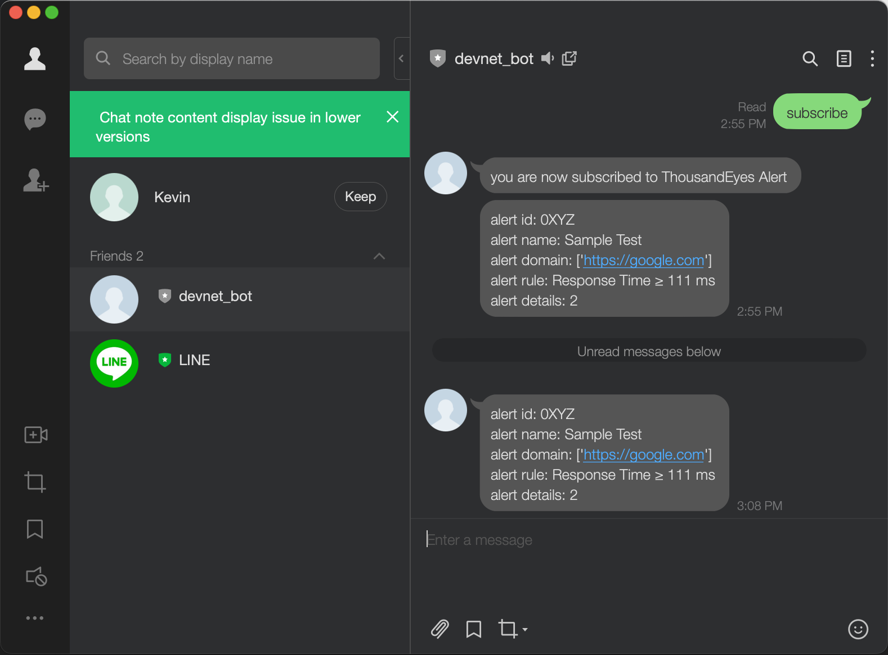
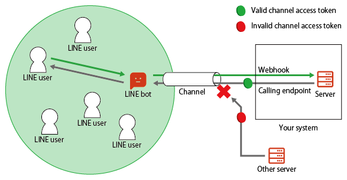

# gve_devnet_thousandeyes_line_bot
This repo is a flask server that receives ThousandEyes webhook alerts and re-format them to be sent to users via an official account on LINE. 


## Contacts
* Kevin Chen

## Solution Components
* ThousandEyes


## Installation/Configuration
1. [Sign up](https://developers.line.biz/en/docs/basics/channel-access-token/) to LINE business account and acquire a channel access token and channel secret.
2. Acquire an SSL certificate to enable HTTPS connection. LINE requires HTTPS for programatic access to its APIs. You can use a certificate from any Certificate Authority, for example [Let's Encrypt](https://letsencrypt.org/getting-started/) and save the certificate and private key files.  
3. Configure the environment variables shown below
```python
# Set environment variable in a .env file (see .env example)
LINE_CHANNEL_ACCESS_TOKEN=12345678
LINE_CHANNEL_SECRET=12345678
CERTIFICATE=/path/to/fullchain.pem
PRIVATE_KEY=/path/to/privkey.pem
```
4. Set up a virtual environment and install dependencies
```
python -m venv myvenv
pip install -r requirements.txt
```
5. Configure ThousandEyes webhook integration
From your ThousandEyes dashboard, access the integrations page via the left nagivation pane. 


Create a new integration by presseing the "New Integration" button. 

Select Custom Webhook and you can now configure the integration to point to your bot server. Put in the URL associated with your server and optionally select a preset configuration (generic is used for this example). 


A basic configuration is shown in the screenshot above. The URL of the webhook server should be the IP address of your bot server or your custom domain. Select the generic preset and the following fields would be auto-filled with example headers and body. 

## Usage

Run the app: 

```
python bot_line.py
```
NOTE: the app may require sudo permissions to run

Once the server is running, to register for an alert from ThousandEyes, the user must first add the official account created above, and send a message to the bot. The bot will inform the user that they are now subscribed to ThousandEyes alerts. Now all future ThousandEyes alerts will be forwarded to that user. Multiple users can be added at the same time, however if the server is restarted, the users must re-register with the bot by sending a new subscribe message. 

# Screenshots

The bot requires channel access token to authenticate with LINE's servers. 


# Docker
This repo contains a dockerfile, which can be used to create an image to run this app in a Docker container. Please provide the full path to fullchain.pem and privkey.pem in the .env file before running the dockerfile.  

### LICENSE

Provided under Cisco Sample Code License, for details see [LICENSE](LICENSE.md)

### CODE_OF_CONDUCT

Our code of conduct is available [here](CODE_OF_CONDUCT.md)

### CONTRIBUTING

See our contributing guidelines [here](CONTRIBUTING.md)

#### DISCLAIMER:
<b>Please note:</b> This script is meant for demo purposes only. All tools/ scripts in this repo are released for use "AS IS" without any warranties of any kind, including, but not limited to their installation, use, or performance. Any use of these scripts and tools is at your own risk. There is no guarantee that they have been through thorough testing in a comparable environment and we are not responsible for any damage or data loss incurred with their use.
You are responsible for reviewing and testing any scripts you run thoroughly before use in any non-testing environment.